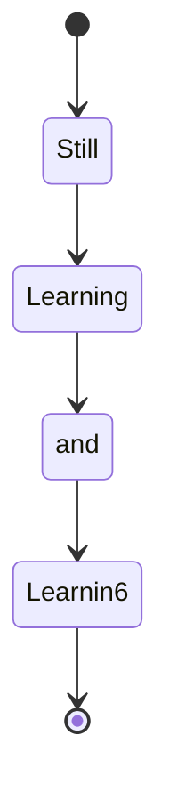

## Learning Python

This repository is dedicated to logging my daily self-learning progress towards mastering Python, with a focus on topics relevant to SRE (Site Reliability Engineering) and DevOps. All content is created and maintained by @yuswitayudi.

This is only my trying-trying to learning python language. Only 4funs

